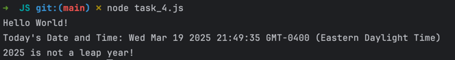
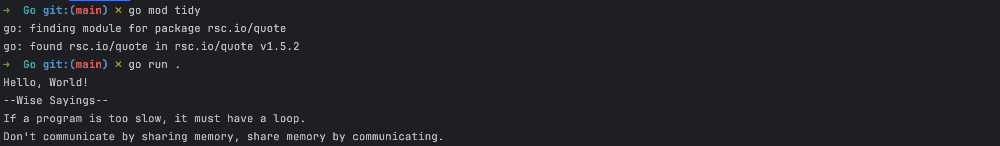

# CS333 - Project 2 - README
### Francis O'Hara
### 3/8/2025

***Google Sites Report: [https://sites.google.com/colby.edu/francis-ohara-cs333/home/](https://sites.google.com/colby.edu/francis-ohara-cs333/home/)***

## Directory Layout:
```
Project2_fohara27
    ├── C
    │   ├── task_1
    │   │   ├── encode.yy
    │   │   ├── encode_test.txt
    │   │   └── lex.yy.c
    │   ├── task_2
    │   │   ├── lex.yy.c
    │   │   ├── vowel_counter.yy
    │   │   └── vowel_counter_test.txt
    │   ├── task_3
    │   │   ├── html_scanner.yy
    │   │   ├── html_scanner_test_1.txt
    │   │   ├── html_scanner_test_2.txt
    │   │   ├── lex.yy.c
    │   │   └── output.txt
    │   └── task_4
    │       ├── clite_parser.yy
    │       ├── clite_parser_test.c
    │       ├── lex.yy.c
    │       └── output.txt
    ├── Go
    │   ├── go.mod
    │   ├── go.sum
    │   └── task_4.go
    ├── JS
    │   └── task_4.js
    ├── README.md
    └── screenshots
        ├── c_task_1_1.png
        ├── c_task_2_1.png
        ├── c_task_3_1.png
        ├── c_task_4_1.png
        ├── c_task_4_2.png
        ├── go_task_4_1.png
        └── js_task_4_1.png

```
## OS and C compiler
OS: macOS Ventura 13.7.4  
C Compiler: Apple clang version 15.0.0 (clang-1500.1.0.2.5)


## Part I: Lexical Analysis
### Task 1
**Description:**  
A flex-generated lexer that shifts each alphabetic character in an input string 13 spaces forward in the alphabet, with 
wraparound from z back to a.  
The lexer uses two rules to achieve this, one for lowercase alphabets (pattern: `[a-z]`) and another for uppercase alphabets (pattern: `[A-Z]`).  
In the flex rule for uppercase alphabets, the action of the rule shifts the matched character using the formula $(65 + ((matched\_character - 65 + 13)\,\%\,26))$.  
In the flex rule for lowercase alphabets, the action of the rule shifts the matched character using a similar formula $97 + ((matched\_character - 97 + 13)\,\%\,26)$  
The input text used to test the generated lexer is stored in `encode_test.txt` and it has the following content:
```
This is the unencoded text. Encoding this text will shift each alphabetic character 13 spaces down the alphabet.
```

**Compile:**  
```
$ flex encode.yy
$ gcc -o encode lex.yy.c -ll 
```

**Run (encode):** `$ ./encode encode_test.txt`

**Run (decode):** `$ ./encode encode_test.txt | ./encode`

**Output:**  


**Explanation:**  
After running the lexer on the input file once, each alphabet in the input file is shifted 13 spaces forward.  
For example, The letter 'T' is replaced with 'G', which is 13 spaces forward from 'T' considering the wraparound from 'z' to 'a'.  
Additionally, running the lexer on the output of the first run reverts to the original as expected.


### Task 2
**Description:**
A flex-generated lexer that reads in a text file and outputs the number of rows, characters, and vowels contained in the text file.  
The code works by initializing three integer variables (`num_rows`, `num_chars`, and `num_vars`) for storing the count of rows, characters, and vowels in the text whose values get output at the end of the program.  
Three rules are used to determine when to increment each of the variables:  
1. Upon matching the newline character `\n`, `num_rows` is incremented by 1 and `num_chars` is also incremented by 1 since a newline character counts as a character.
2. Upon matching any vowel `[aeiouAEIOU]`, `num_vowels` is incremented by 1, `num_chars` is incremented by 1 since a vowel character counts as a character, and `num_rows` is also incremented by 1 if its current value is 0 since we want to be able to account for files that contain just one row that does not terminate with a newline character.
3. Upon matching any non-newline character `.`, `num_chars` is incremented by 1 and `num_rows` is also incremented by 1 if its current value is 0 since we want to be able to account for files that contain just one row not terminated by a newline character.  

The rules appear in the above-mentioned order exactly in the flex source program since we don't want the second rule matching vowels to be overshadowed by the rule matching characters.  
The input text used to test the generated lexer is stored in `vowel_counter_test.txt`, and it has the following content:
```
Hello World. This is a test file for a simple flex program.
Good bye Earth! 
```
It has **2 rows**, **75 characters** (including the newline separating row 1 from row 2), and **21 vowel characters**. 

**Compile:**  
```
$ flex vowel_counter.yy
$ gcc -o vowel_counter lex.yy.c -ll
```

**Run:**  `$ ./vowel_counter vowel_counter_test.txt`

**Output:**  
  

**Explanation:**  
The screenshot above shows that the program correctly identifies that there are 2 rows, 75 characters, and 21 vowel characters in the input file `vowel_counter_test.txt`.

### Task 3
**Description:**
A flex-generated lexer for stripping an HTML file of tags, single-line comments, and extraneous whitespace.  
The code specifically does the following things:
 - Removes HTML tags (i.e. any sequence of characters beginning with `<` and ending with `>` with no angle brackets in between.)
 - Removes any occurrence of a tab `\t` or single space ` `.
 - Replaces any occurrence of more than one newline character `\n` in a row with a single newline character.
 - Removes any occurrence of a single newline character `\n`.  

The following flex rules were used in the exact order specified below to achieve the above outcomes:
1. Upon matching the pattern `\<[^<>]+\>`, ignore it to remove single-line and multi-line HTML tags from the output.
2. Upon matching the pattern `[ \t]+`, ignore it to remove all single spaces and tabs from the output.
3. Upon matching the pattern `\n{2,}`, replace with a single newline character `\n` to replace all occurrences of more than one newline character in a row with a single newline.
4. Upon matching the pattern `\n`, ignore it to remove all occurrences of single newline characters `\n` from the output.

Two input texts were used to test the generated lexer both of which are stored in `html_scanner_test_1.txt` and `html_scanner_test_2.txt`.
The following is the content of `html_scanner_test_1.txt`:  
```
<!DOCTYPE html>
<html lang="en">
		<head>
				<title>This is a page title</title>
		</head>

		<body>
				<h3>Here is a header</h3>

				<p>
						Here is some body text in a paragraph</p>

				<p>
						<a href="cs.colby.edu">Here is a link to cs.colby.edu</a>
						inside a paragraph.
				</p>

				<!-- Here is a single line comment -->
				<!-- Here is a multi-line
					 comment -->
		</body>
</html>
```

**Compile:** 
```
$ flex html_scanner.yy
$ gcc -o html_scanner lex.yy.c -ll
```

**Run:** `$ ./html_scanner html_scanner_test_1.txt`

**Output:**  


**Explanation:**  
The above output confirms that the generated lexer is able to remove all HTML tags, spaces, and tabs in addition to replacing all occurrences of more than one newline character in a row with a single newline character.


### Task 4
**Description:**  
A flex-generated parser for C-Lite, a light-weight version of the C programming language.  
This program not only scans for particular sequences of characters, but outputs the group of non-terminal and terminal symbols
the sequence of characters belongs to according to the C-Lite syntax.  

The parser only implements a subset of the production rules in the official C-Lite syntax and those rules and the corresponding output for each are included in the image below:  


For each of the above production rules and corresponding outputs, a rule is included in the rules section of the flex source program that implements the production rule.  
In addition to the above rules, the parser also ignores all single-line comments, multi-line comments, whitespace, and semicolons.  
Comments were included above each rule in the flex source file to identify the specific function of each rule.

The input text used to test the generated parser is stored in `clite_parser_test.c`, and it has the following content:  
```
int main() {
  // this is a single-line comment
  /* this is a multiline comment

containing a /backslash/ */

  int a = 6;
  int b = 5.0;

  if( a < b ) {
    a = a + b;
  }
}
```

**Compile:**
```
$ flex clite_parser.yy
$ gcc -o clite_parser lex.yy.c -ll
```

**Run:** `$ ./clite_parser clite_parser_test.c`

**Output:**  
  

**Explanation:**  
The output confirms that the parser program is able to correctly parse the above-specified subset of the C-Lite syntax and gives the expected output.
All whitespace, comments, and semicolons in the input program are ignored and all tokens that match any of the production rules specified in the table above were correctly replaced with their expected output.

## Part II: Selected Languages
### Task 1
The following is the link to my organized Google Sites homepage for CS333:  
*[https://sites.google.com/colby.edu/francis-ohara-cs333/home/](https://sites.google.com/colby.edu/francis-ohara-cs333/home/)*  

It contains a section for each language with a link to each project page.

### Task 2
I created a subpage for each selected language in project 2 and the following are the links to each subpage:
 - **JavaScript:** *[https://sites.google.com/colby.edu/francis-ohara-cs333/home/project-2-js](https://sites.google.com/colby.edu/francis-ohara-cs333/home/project-2-js)*
 - **Go:** *[https://sites.google.com/colby.edu/francis-ohara-cs333/home/project-2-go](https://sites.google.com/colby.edu/francis-ohara-cs333/home/project-2-go)*

### Task 3
I searched for useful resources, documentation, and formal descriptions of each of the above-selected languages and included them in the first section of their respective subpages.

### Task 4 --JavaScript
For my JavaScript "hello world" program, I wrote a program that prints out the current date and time and additionally prints whether the current year is a leap year.  
The filename of the program is `task_4.js`, and it can be executed using the Node.js runtime environment.  
Instructions for installing the Node.js runtime environment can be found on the official Node.js website: *[https://nodejs.org/en/download](https://nodejs.org/en/download)*  

**Run:** `node task_4.js`

**Output:**  


### Task 4 --Go
For my Go 'Hello World' program, I decided to write a program that imports a Go package stored in a remote repository (rsc.io/quote) with functions that return various proverbial sayings and prints some of the sayings.  
The official instructions for installing Go are available here: https://go.dev/doc/install  
`rsc.io/quote`'s documentation is also available here: https://pkg.go.dev/rsc.io/quote/v4

**Run:**  
```
$ go run task_4.go 
```

**Output:**


## Extensions
### Extension 1
**Description**  
I decide to allow comments to work properly in my parser for HTML.
The compile and run instructions as well as the program's outcome are same as that of C task 3.

### Extension 2
**Description**  
For this extension, I decided to get comments to work properly in my parser for C-Lite.
The compile and run instructions as well as the program's outcome are same as that of C task 4.

### Extension 3
**Description**  
For this extension, I decided to implement an additional selected language part aside JavaScript.  
I chose to implement the hello world program in the Go programming language and found various learning resources online for learning Go which I put on the project report page.
