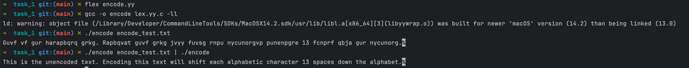
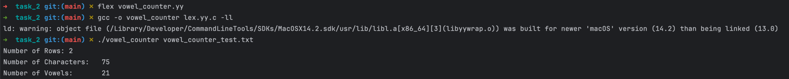
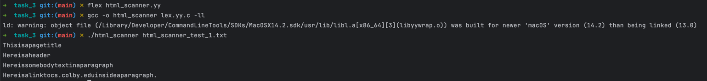
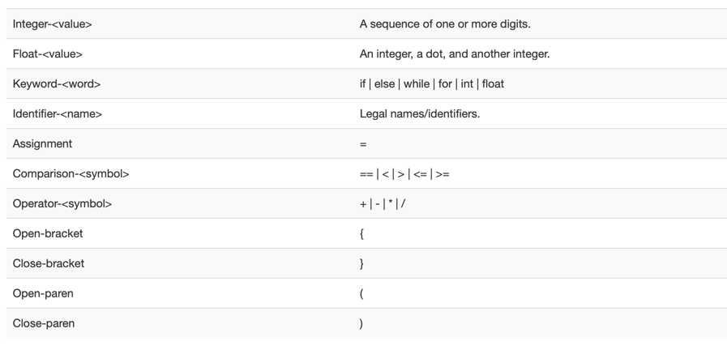
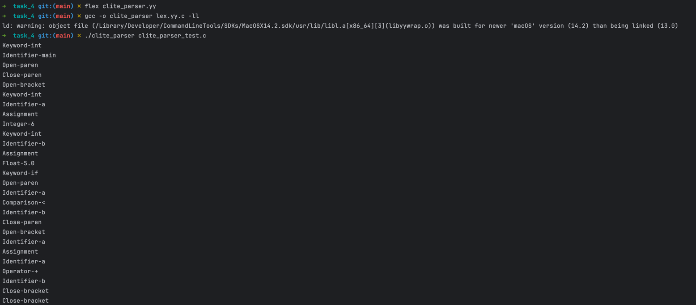

# CS333 - Project 2 - README
### Francis O'Hara
### 3/8/2025

***Google Sites Report: [https://sites.google.com/colby.edu/francis-ohara-cs333/home/](https://sites.google.com/colby.edu/francis-ohara-cs333/home/)***

## Directory Layout:
```
Project1_fohara27
    ├── README.md
    ├── extension_1.c
    ├── extension_2.c
    ├── screenshots
    │   ├── c_extension_1_1.png
    │   ├── c_extension_2_1.png
    │   ├── c_task_1_1.png
    │   ├── c_task_2_1.png
    │   ├── c_task_2_2.png
    │   ├── c_task_2_3.png
    │   ├── c_task_3_1.png
    │   ├── c_task_3_2.png
    │   ├── c_task_4_1.png
    │   ├── c_task_4_2.png
    │   ├── c_task_4_3.png
    │   ├── c_task_4_4.jpg
    │   ├── c_task_4_5.jpg
    │   └── c_task_5_1.png
    ├── task_1.c
    ├── task_2.c
    ├── task_3.c
    ├── task_4.c
    └── task_5.c

```
## OS and C compiler
OS: macOS Ventura 13.7.4  
C Compiler: Apple clang version 15.0.0 (clang-1500.1.0.2.5)


## Part I
### Task 1
**Description:**  
A flex-generated lexer that shifts each alphabetic character in an input string 13 spaces forward in the alphabet.  
The matci

**Compile:**  
```
$ gcc -o task_1 task_1.c`  
$ gc
```

**Run:** `$ ./task_1`

**Output:**  


**Output:**  

**Explanation:**  
The 


### Task 2
**Compile:** `$ gcc -o task_2 task_2.c`

**Run:** `$ ./task_2`

**Output:**  
  
  


**Q.b.**  
b.	The overall layout of the stack is such that variables declared on the stack are stored next to each other in consecutive memory locations from the most recently declared variable to the least recently declared variable in memory.  
Variables declared in stack memory can be imagined as being stored in a stack data structure with the most recently declared variable at the top of the stack and the least recently declared variable at the bottom of the stack.  
As a pointer pointing to any byte on the stack is incremented, we go down the stack.  
The `ptr` variable for instance is the most recently declared variable and can be considered as being at the top of the stack.  
And since pointers occupy 8 bytes in memory, the first 8 bytes printed represent the memory location of `ptr`.  
The following 8 bytes are for the long declared right before `ptr`. The next 4 bytes are for the `int` and so on.


**Q. c.**  
c.	The non-zero values from index 24 do not make immediate sense. This is because index 24 is the last byte (MSB) of the first declared variable.  
Hence, indexing beyond that implies accessing memory locations beyond the region in the stack in which memory was allocated for our declared variables.

**Q. d.**  
I can find the variables defined in the C program in the printed output. The first 8 indices correspond to the ptr variable.  
The next 8 correspond to the long_integer variable, the next 4 correspond to the integer variable and so on.


### Task 3
**Compile:** `$ gcc -o task_3 task_3.c`

**Run:** `$ ./task_3`

**Output:**
1. Without `free()` statement (17.14 GB memory usage):  
   

2. With `free()` statement (348 KB memory usage):  
   

**Q.b.**  
Without the `free()` statement, the program requires significantly more memory over time (about 500 MB every few seconds).  
But with the `free()` statement, the program requires a constant amount of memory over time (348 KB).


### Task 4
**Compile:** `$ gcc -o task_4 task_4.c`

**Run:** `$ ./task_4`

**Output:**  
  


**Q.a.**  
For this task, I created 3 different structs: `Structure1`(char, short, int), `Structure2` (char, int, short) and `Structure3`(char, long, int).  
From this task I learned the following two rules about struct byte alignment and will use each struct to explain:

    Rule 1: The size of the struct must be a multiple of the largest type among the members of the struct.  
    Rule 2: Any member of the struct can only be placed at a memory address that is a multiple of the size of the member’s datatype.

**Structure1**  
`Structure1` consists of a `char`, followed by a `short`, and a `int` and the following is a drawing of how its instance’s contents were laid out in memory:  

*Figure 1. Memory layout of Structure1 instance. Each square is a byte of memory and the indices are memory addresses.  
The instance members were assigned the values char `0xA1`, short `0xA1B2`, and int `A1B2C3D4`.*

The char is assigned to memory address 0. However, although the next available memory address is 1, it is padded with 0s and the short is assigned to memory address 2 because from **rule 2**, each member of the struct can only be stored in an address that is a multiple of the size of the member’s type (2 bytes in the case of short).  
The int is however stored in the next available memory address of 4 since the size of int is 4 bytes.  
The size of the struct is 8 bytes even though the minimum number of bytes required to store all members of the struct is 7 bytes `(sizeof char + sizeof short + sizeof int)`, and this is because of rule 1 (total size of struct must be multiple of size of largest type in struct).

**Structure2**  
`Structure2` consists of a `char`, followed by an `int`, followed by a `short`.

*Figure 2. Memory layout of Structure2 instance. Each square is a byte of memory and the indices are memory addresses.
The instance members were assigned the values char `0xA1`, int `A1B2C3D4`, and short `0xA1B2`.*

The char is assigned to memory address 0. Here also, though the next available memory address is 1, the next member of the struct is an int and has to be stored in a memory address that is a multiple of 4 because of **rule 2**.   
Hence, the int is stored in memory address 4 which is the next available multiple of 4.  
Likewise, the short was stored in the next available memory address of 8 because memory address 8 is the next multiple of 2 (size of short).  
But even after all members of the struct are stored, it is padded with 2 bytes of 0s so that it’s total size is 12 bytes.  
This was done because of **rule 1** (total size of struct must be a multiple of size of largest type in struct).  
Since the largest type in Structure2 is int, the 2 bytes padded at the end are there to ensure that the total size of the struct is a multiple of 4.

**Structure3**  
`Structure3` consists of a `char`, followed by a `long`, followed by an `int`.  

*Figure 3. Memory layout of Structure3 instance. Each box represents a byte of memory and the indices are memory addresses.
The instance members were assigned the values char `0xA1`, long `0xA1B2C3D4E5F6A7B8`, and int `A1B2C3D4`.*

The char is assigned to memory address 0. The long is, however, assigned to memory address 8 since that is the next available memory address that is a multiple of 8 (size of long) and all empty bytes before it are padded with 0s.  
The int is then assigned to memory address 8 since that is the next available address that is a multiple of 4 (size of int).  
The next 4 bytes are padded with 0s so that the total size of the struct is a multiple of the size of the largest member of the struct (long) and this is why the total size of the struct is 24 bytes instead of the minimum required 13 bytes `(sizeof char + sizeof long + sizeof int)`.

**Q.b.**
Yes, there are gaps, and they are because of the aforementioned struct byte alignment rules.

### Task 5
**Compile:** `$ gcc -o task_5 task_5.c`

**Run:** `$ ./task_5`

**Output:**  


**Q.a.**  
The string I found that doesn’t work is “AAAAAAAAAAAAA” (13 As) which yielded a positive bank balance of 65.

**Q.b.**  
Screenshot included above.

**Q.c.**  
Despite being initialized to 0, the bank balance increases to a positive value because its contents are overwritten when `scanf()` receives bad input (i.e. a buffer overflow occurs).  
The `Account` struct instance is laid out in memory such that the first 10 bytes (byte 0-9) are meant to contain the contents of the string member `name[10]`.   
The next two bytes (byte 10-11) are padded with 0s due to the struct byte alignment rules. Finally, the next 4 bytes (byte 12-15) store the contents of the integer bank balance.  
Therefore, if any input string is entered consisting of 13 or more characters whose ASCII values are not 0, the 13th character and over will end up getting written to bytes 12 – 15 which are the bytes containing the value of integer bank balance, thus resulting in a non-zero bank balance.  
Although entering only 12 characters is enough to cause a buffer overflow since the 12 characters will occupy bytes 0-11 and the null terminator ‘\0’ will occupy byte 12 (the first byte of the integer bank balance), the null terminator character is equivalent to the value 0 and will therefore have no effect on the first byte of the bank balance which has already been set to 0 at the start of the program.


## Extensions
### Extension 1
**Description**  
For this extension, I decided to make task 5 in part I more robust so that the inputs won't impact the initial balance.
To achieve this, I simply changed the order of declaration of the struct members so that integer bank balance is declared first and the name of the account is declared afterwards.  
As a result, a buffer overflow of the input name will not overwrite the bytes of the integer bank balance since the bank balance will be stored before the account name in memory.


**Compile:** `$ gcc -o extension_1 extension_1.c`

**Run:** `$ ./extension_1`

**Output:**  


### Extension 2
**Description**  
For this extension, I wrote a simple C program that generates a segmentation fault runtime error.  
It does so by creating and attempting to deference a pointer that points to an illegal memory address.

**Compile:** `$ gcc -o extension_2 extension_2.c`

**Run:** `$ ./extension_2`

**Output:**  


### Extension 3
**Description**  
For this extension, I decided to research a fifth programming language (C#) and included my findings in my Google Site report for project 1.

**Link:** The link to the specific section of my report in which I elaborate on my findings is [available here](https://sites.google.com/colby.edu/francis-ohara-cs333/home/project-1?authuser=1#h.7acaol1l6nrv).
