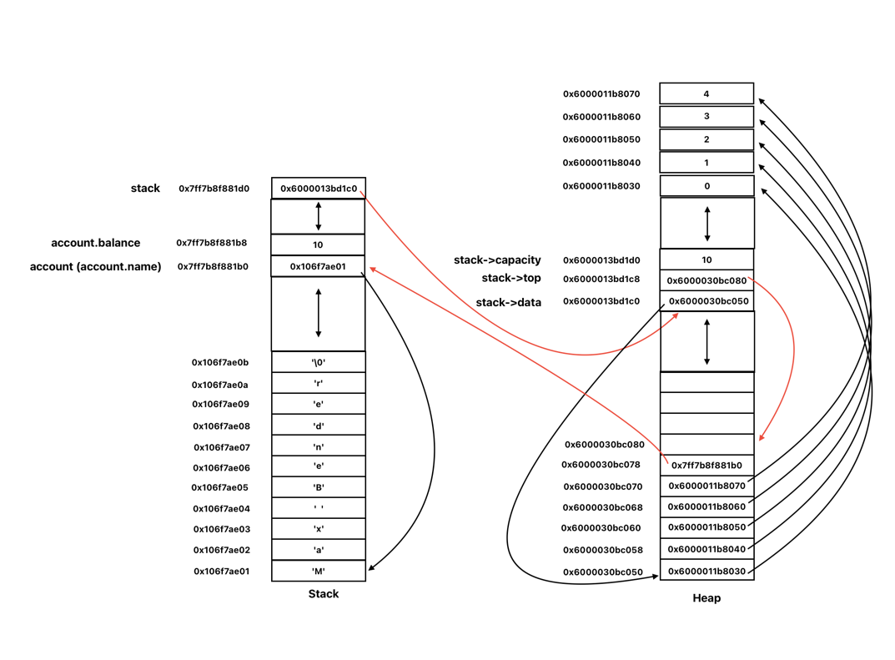

# CS333 - Project 3 - README
### Francis O'Hara
### 03/21/2025

***Google Sites Report: [https://sites.google.com/colby.edu/francis-ohara-cs333/home/](https://sites.google.com/colby.edu/francis-ohara-cs333/home/)***

## Directory Layout:
```
Project1_fohara27
    ├── README.md
    ├── extension_1.c
    ├── extension_2.c
    ├── screenshots
    │   ├── c_extension_1_1.png
    │   ├── c_extension_2_1.png
    │   ├── c_task_1_1.png
    │   ├── c_task_2_1.png
    │   ├── c_task_2_2.png
    │   ├── c_task_2_3.png
    │   ├── c_task_3_1.png
    │   ├── c_task_3_2.png
    │   ├── c_task_4_1.png
    │   ├── c_task_4_2.png
    │   ├── c_task_4_3.png
    │   ├── c_task_4_4.jpg
    │   ├── c_task_4_5.jpg
    │   └── c_task_5_1.png
    ├── task_1.c
    ├── task_2.c
    ├── task_3.c
    ├── task_4.c
    └── task_5.c

```
## OS and C compiler
OS: macOS Ventura 13.7.4  
C Compiler: Apple clang version 15.0.0 (clang-1500.1.0.2.5)


## Part I
### Task 1
**Description:**  
The `cstk.h` file was defined [here](C/cstk.h) and contains all the necessary structures and declarations of the basic functions of a stack.


### Task 2
**Description:**  
The `cstk.c` file was defined [here](C/cstk.c) and implements all the basic functions declared in [`cstk.h`](C/cstk.h).


### Task 3 
**Compile:** `$ gcc -o cstktest cstktest.c cstk.c`

**Run:** `$ ./cstktest`

**Output:**  
  


### Task 4
**Description:**  
The video available at this [Google Drive link](https://drive.google.com/file/d/1YXVFFEfKqcUmVTtwMtdA3s_jxlvz8ik8/view?usp=sharing) shows that my implementation of `stk_destroy()` passes the memory leak tests in [cstktest.c](C/cstktest.c).  
It is also available in my submission folder here: [screenshots/c_task_4_1.mov](screenshots/c_task_4_1.mov).

**Compile:** `$ gcc -o cstktest cstktest.c cstk.c`

**Run:** `$ ./cstktest`

**Output:**  
  


### Task 5
**Description:**  
I added code for printing out all memory addresses and values at Mark 1 and Mark 2.

**Mark 1 Memory Diagram:**  
  
The addresses in this diagram are labeled so that larger memory addresses are above lower memory addresses.  
The diagram shows that at Mark 1, a Stack struct instance has been created on the heap and a pointer to this stack is being stored on stack space in the variable `s`.
The integer variable `i` is also being stored on the stack.  
On the heap, two 8-byte blocks of memory were allocated for the `s->data` and `s->top` pointers of the stack and a 4-byte block of memory was allocated for the `capacity` of the stack.  
`s->data` points to the 1st block in twenty 4-byte blocks of memory that were allocated to hold integers stored on the stack.  
`s->top` points to the 11th block among the twenty 4-byte blocks which is where the next integer is to be pushed unto the stack.  
Since a pointer to a struct is the same as a pointer to the first member of the struct, the address pointed to by `s` is actually the address of `s->data`, which is the first member of the `Stack` struct.  


**Mark 2 Memory Diagram:**  
  
At Mark 2, `stack_destroy()` has been called with Stack `s` as argument, and hence, the memory allocated for Stack `s` on the heap has been deallocated and is no longer visible in the memory diagram.  
The memory allocated for `s->data` is also destroyed after the call to `stack_destroy()`.  
The variable `s` on the stack still holds the old memory address of Stack `s` on the heap even though that memory has now been deallocated.


### Task 6
**Description:**  
I implemented all functions in [cstk2.c](C/cstk2.c) as well as the `intToString()` and `account_ToString()` methods within the [cstktest2.c](C/cstktest2.c) test file and all tests passed successfully as shown in the program output below.  
I included single-line comments in the `stk_toString()`, `intToString()` and `account_ToString()` functions to explain the approach I followed to implement each function.
 - The approach I followed to implement the `stk_toString()` method involves computing the exact number of bytes that will be required to store all characters in the result string before finally allocating memory for the result string and populating it with characters.   
   -  I defined a helper function `len()` that returns the number of characters in a string. I used this helper method to find the number of characters in the string representation of each item on the stack (i.e. the number of bytes to be allocated for each item in the memory to be allocated for the result string).  
   -  I also accounted for the opening and closing square brackets in the result string, the ' ' and ',' characters separating each item of the stack in the result string, and the null terminator character at the end of the result string.  
   -  I then finally allocated memory for the result string, and made heavy use of pointers to copy the appropriate characters into the memory allocated for the result string before returning a pointer to the result string.
 - To implement the `intToString()` function, I used the modulo 10 and integer division by 10 to obtain the rightmost value of the given integer.  
   - I then used this value to index into a character array that maps each integer index to its corresponding character representation which I then stored in the result string for representing the entire integer.
   - I added conditional statements to account for edge cases like when the given number is negative or `0`.  
 - To implement the `account_ToString()` function, I used the `intToString()` function to convert the balance of each account into its string representation, which I copied into the result string using pointers.
   - I then used pointers again to copy the account name string into the result string before finally terminating the result string with a null terminator.
 - In both `intToString()` and `account_ToString()`, I computed the exact number of bytes required for the result string before allocating it, and I made sure all dynamically allocated memory within each function's implementation was freed with the exception of the memory allocated for the result string which needs to be freed outside each function.
   
**Compile:** `$ gcc -o cstktest2 cstktest2.c cstk2.c`

**Run:** `$ ./cstktest2`

**Output:**  
  

The video available at this [Google Drive link](https://drive.google.com/file/d/16-4EzA_FZnnajNxbaabDkGNYOAN3PsIo/view?usp=share_link) also shows that none of the implemented functions in [cstk2.c](C/cstk2.c) cause memory leaks.  
The video is also available in my submission folder here: [screenshots/c_task_6_1.mov](screenshots/c_task_6_1.mov)


**Mark 1 Memory Diagram:**  
The following is my memory diagram at Mark 1 of [toDraw2.c](C/toDraw2.c):  



## Part II: Selected Languages
### Task 1

## Extensions
### Extension 1
**Description**  
For this extension, I decided to make task 5 in part I more robust so that the inputs won't impact the initial balance.
To achieve this, I simply changed the order of declaration of the struct members so that integer bank balance is declared first and the name of the account is declared afterwards.  
As a result, a buffer overflow of the input name will not overwrite the bytes of the integer bank balance since the bank balance will be stored before the account name in memory.


**Compile:** `$ gcc -o extension_1 extension_1.c`

**Run:** `$ ./extension_1`

**Output:**  


### Extension 2
**Description**  
For this extension, I wrote a simple C program that generates a segmentation fault runtime error.  
It does so by creating and attempting to deference a pointer that points to an illegal memory address.

**Compile:** `$ gcc -o extension_2 extension_2.c`

**Run:** `$ ./extension_2`

**Output:**  


### Extension 3
**Description**  
For this extension, I decided to research a fifth programming language (C#) and included my findings in my Google Site report for project 1.  

**Link:** The link to the specific section of my report in which I elaborate on my findings is [available here](https://sites.google.com/colby.edu/francis-ohara-cs333/home/project-1?authuser=1#h.7acaol1l6nrv).
