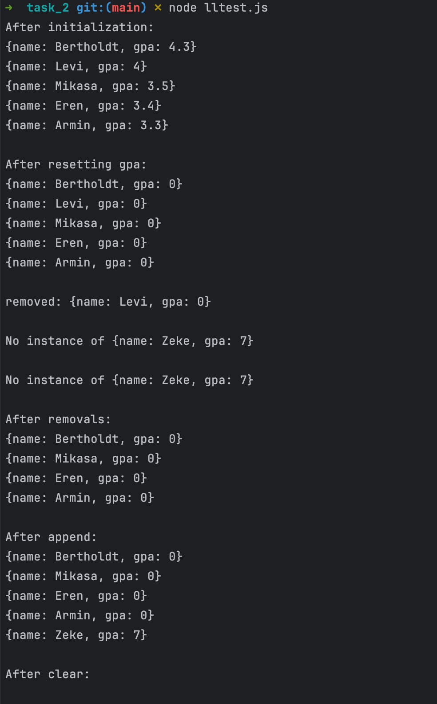

# CS333 - Project 4 - README
### Francis O'Hara
### 04/20/2025

***Google Sites Report: [https://sites.google.com/colby.edu/francis-ohara-cs333/home/](https://sites.google.com/colby.edu/francis-ohara-cs333/home/)***

## Directory Layout:
```
Project4_fohara27
```
## OS and C compiler
OS: macOS Sequoia 15.4  
C Compiler: Apple clang version 17.0.0 (clang-1700.0.13.3)


## Part I
### Task 1
**Description:**  
To implement the comparator function, I first computed the actual integer values pointed to by the void pointers passed as arguments to the function.
I then accounted for the 4 possible cases of the evenness or oddness of the input numbers `p` and `q`, and specified what value should be returned in each based on our desired sorting order.
- `p` and `q` are equal    ==> return 0.
- `p` is even, `q` is even ==> return negative number if `p` is greater than `q` and return positive number otherwise (to achieve even numbers sorting in descending order).
- `p` is even, `q` is odd  ==> return negative number (to achieve even numbers appearing before odd numbers)
- `p` is odd, `q` is even ==> return positive number (to achieve even numbers appearing before odd numbers) 
- `p` is odd, `q` is odd ==> return positive number if `p` is greater than `q` and return negative number otherwise (to achieve odd numbers sorting in ascending order)

**Compile:** `$ gcc -o quicksort quicksort.c`

**Run:** `$ ./quicksort`

**Output:**  


### Task 2
**Description:**
For this task I implemented my factorial function in the source file [factorial.c](C/factorial.c).  
The main function expects a command-line argument, which is the integer value whose factorial is to be found, and error
checking is done to ensure this argument is provided in addition to ensuring that the provided number is a non-negative integer.

**Compile:** `$ gcc -o factorial factorial.c`

**Run (N=5):**  
`./factorial 5`  

**Output (N=5):**  


**Explanation:**  
The output demonstrates that the algorithm I implemented for computing factorial is correct as $5!$ is indeed $120$.  
In terms of the implementation, the `factorial()` function I defined for computing the factorial is not actually invoked in the code, but rather a `calc` function pointer that points to the address of the factorial function is invoked and still achieves the same result as calling the `factorial()` function directly.  
This shows that a function pointer variable can store the address of any function regardless of the identifier name as long as it has the same parameter types and return types.

**Run (N=12):**  
`./factorial 12`

**Output (N=12):**  


**Run (N=13):**  
`./factorial 13`

**Output (N=13):**  


**Run (N=14):**  
`./factorial 14`

**Output (N=14):**  


**Run (N=15):**
`./factorial 15`

**Output (N=15):**  


**Explanation:**  
The result for $12!$ is accurate. However, for $13!$, $14!$, and $15!$ the result obtained is incorrect.  
This is because the factorial function we defined has a return type of `int` and the maximum possible value representable by an integer is 
$2^{31} - 1$.  
Hence, only $12!$ is in the range of `int` but $13!$, $14!$, and $15!$ are all out of the range of `int` and therefore cause overflow errors which leads to inaccurate answers.


### Task 3 
#### 3A) and 3B)  
**Description:**
I implemented my linkedlist class in the files [linkedlist.c](C/linkedlist.c) and [linkedlist.h](C/linkedlist.h).  
My linkedlist class passes all the original tests involving a LinkedList with integer data members.


**Compile:** `$ gcc -o clltest clltest.c linkedlist.c`

**Run:** `./clltest`

**Output:**  


#### 3C) and 3D)
**Description:**  
I extended [clltest.c](C/clltest.c) so it uses a linkedlist of `Student` structs which I defined in the test file.  
The `Student` struct has a `name` field which is a 256-character character array, and a `gpa` field which is a float.  
None of these fields are pointers.
I defined a custom function `reset_gpa()`for resetting each `Student` node in the linked list's gpa to 0.
I also defined a function `print_student()` for printing `Student` instances and another function `comp_student()` for comparing `Student` instances.

**Compile:** `$ gcc -o clltest clltest.c linkedlist.c`

**Run:** `./clltest`

**Output:**


#### 3E)
**Description:**  
For this task, I created a second version of the Student struct `Student1` which has pointer data members for which memory can be dynamically allocated on the heap.  
Hence, to clear all nodes in a LinkedList of `Student1` instances requires freeing the `Student1` instances themselves in addition to the data members of each `Student1` instance.  
I also defined a function `free_student()` for freeing `Student1` instances correctly.  
In my test for this task, I first call `ll_clear()` passing the regular `free()` method, and afterward call `ll_clear()` passing the `free_student()` function that correctly frees both the `Student1` instance and its data members.  
I record the memory usage for each using Mac OS's activity monitor.

**Compile:** `$ gcc -o clltest clltest.c linkedlist.c`

**Run with free():** `./clltest`

**Memory usage with free():**  
  


**Run with free_student():** `./clltest`

**Memory usage with free_student():**  
  

**Explanation:**  
The above results show that the free function is an important parameter for `ll_clear()` as improperly freeing the data stored in each node of the LinkedList can result in memory leaks.  
Merely calling the standard `free()` function on each node's data value is not enough as some data values are structs that require custom free functions in order to be properly freed without causing memory leaks.

## Part II: Selected Languages
### Task 1
**Description:**  
For this task, I decided to implement the bubble sort algorithm for sorting an array of objects in JavaScript.
To allow the program to be able to sort an array of arbitrary type in any arbitrary order, I implemented the `bubbleSort()` sorting function
such that in addition to accepting the array to be sorted as argument, it also accepts a comparator function capable of comparing values of a specific type.  
The comparator function must accept two input arguments `arg1` and `arg2` of the same arbitrary type and will output 1 of 3 possible integer values:  
- $-1$ if `arg1` is less than `arg2`
- $0$ if `arg1` is equal to `arg2`
- $1$ if `arg1` is greater than `arg2`

In the first test example of the program, the `bubbleSort()` function is used to sort an array of `Student` instances, where `Student` is a basic user-defined class with a `name` string attribute and a `gpa` float attribute.  
The custom function I defined for comparing these `Student` instances, `compareStudent()` compares students according to their `gpa` attribute.  

In the second test example of the program, the `bubbleSort()` function is used to sort an array of `Numbers` in descending order.  
This is achieved by defining a custom comparator function `compareNumbersInDescendingOrder()` that compares Numbers such that a number smaller than another number is considered larger than that number.  

This program is meant to run in the NodeJS runtime environment.   
Instructions for installing the Node.js runtime environment can be found on the official Node.js website: *[https://nodejs.org/en/download](https://nodejs.org/en/download)*  

**Run:**  `$ node task_1.js`

**Output (Students):**    


**Output (Numbers):**  


**Explanation:**  
The program output demonstrates that the bubble sort algorithm implemented in the `bubbleSort()` function is able to correctly sort an array of arbitrary type as it was able to sort both an array of `Student` instances and an array of `Number` primitives.  
The second test example specifically demonstrates that given an appropriate comparator function, the `bubbleSort()` function is able to sort the input array in an arbitrary order such as in descending order.


### Task 2
**Description:**  
For this task, I implemented a polymorphic LinkedList class in JavaScript. 
Since JavaScript is dynamically typed, I merely needed to define a `Node` class and a `LinkedList` class and at run time, 
the data value passed to the nodes of the list will determine the datatype the list supports.  
I gave the LinkedList class all the methods defined in the C LinkedList class in part I including a constructor for creating linked lists, 
a `push()` method, `append()`, `pop()`, `clear()`, `remove()`, `find()`, and `map()` methods.  


In order for the `map()` method to be able to modify the values stored in the nodes of the LinkedList in place, the LinkedList can only support object types but not primitive types.  
Unlike C, in which there are explicit pointers to memory addresses that can be used to modify variables of primitive type, JavaScript has no such pointers and is additionally pass by value for primitive types.  
Hence, there is no way of modifying the value stored in the nodes of the Linked List if the value is of primitive type.  
Hence, to create a linked list of primitive type, a wrapper class must be used with an attribute storing the primitive value, so that `map()` can be used to update the data values of the Linked List through pass reference by value.

To test the Linked List class, I used two example programs with each storing a Linked List of different types.  
The first example program is for a LinkedList of type `NumberWrapper` which is a wrapper class I defined for creating a LinkedList of type `Number`.  
The second example program is for a LinkedList of type `Student` which is a custom class I defined with two attributes `name` and `gpa`.

**Run:** `$ node lltest.js`

**Output (NumberWrapper):**  
  


**Output (Student):**
  


**Explanation:**  
The results above show that the LinkedList is polymorphic and is able to store data values of different types such as a `NumberWrapper` type and a `Student` type.  

