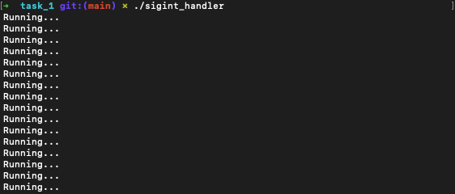
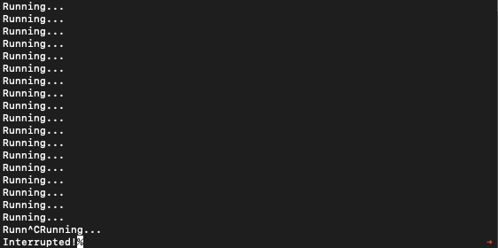
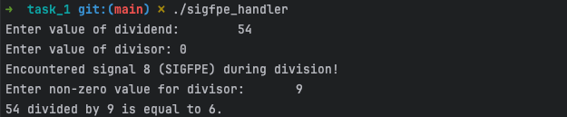
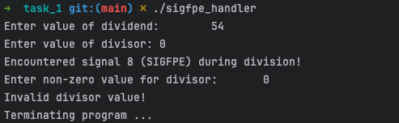
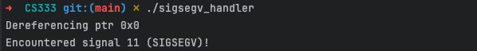

# CS333 - Project 5 - README
### Francis O'Hara
### 04/23/2025

***Google Sites Report: [https://sites.google.com/colby.edu/francis-ohara-cs333/home/](https://sites.google.com/colby.edu/francis-ohara-cs333/home/)***

## Directory Layout:
```
Project5_fohara27
```
## OS and C compiler
OS: macOS Sequoia 15.4  
C Compiler: Apple clang version 17.0.0 (clang-1700.0.13.3)


## Part I
### Task 1

**A) SIGINT Handler**  
**Compile:** `$ gcc -o sigint_handler sigint_handler.c`

**Run:** `$ ./sigint_handler`

**Output:**  
  


**B) SIGFPE Handler**  
To trigger a floating point exception signal (SIGFPE), I decided to divide an integer value by 0.  
The program I wrote takes two input numbers from the user and attempts to divide the two. If the user provides zero as the value of the divisor, a SIGFPE is triggered and the handler function is called.  
The handler function attempts to resolve the error by allowing the user to provide an updated value for the divisor.  
The program terminates with a non-zero exit code if the new divisor value provided by the user is still equal to zero.   
Otherwise, the main program's execution is continued.  

**Compile:** `$ gcc -o sigfpe_handler sigfpe_handler.c`

**Run:** `$ ./sigfpe_handler`

**Output (continue):**  


**Output (exit):**  



**C) SIGSEGV Handler**  
To trigger a segmentation fault signal (SIGSEGV), I decided to dereference a null pointer.  

**Compile:** `$ gcc -o sigsegv_handler sigsegv_handler.c`

**Run:** `$ ./sigsegv_handler`

**Output:**  



### Task 2
**Description:**

**Compile:** `gcc -o factorial factorial.c`

**Run:** ``

**Output:**  


**Explanation:**  

## Part II: Selected Languages
### Task 2

**Code Preview:**  


**Run:**  `$ `

**Output Preview:**  

